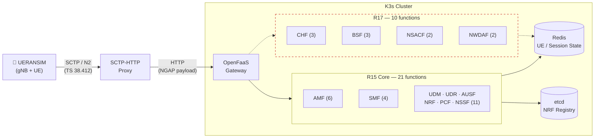
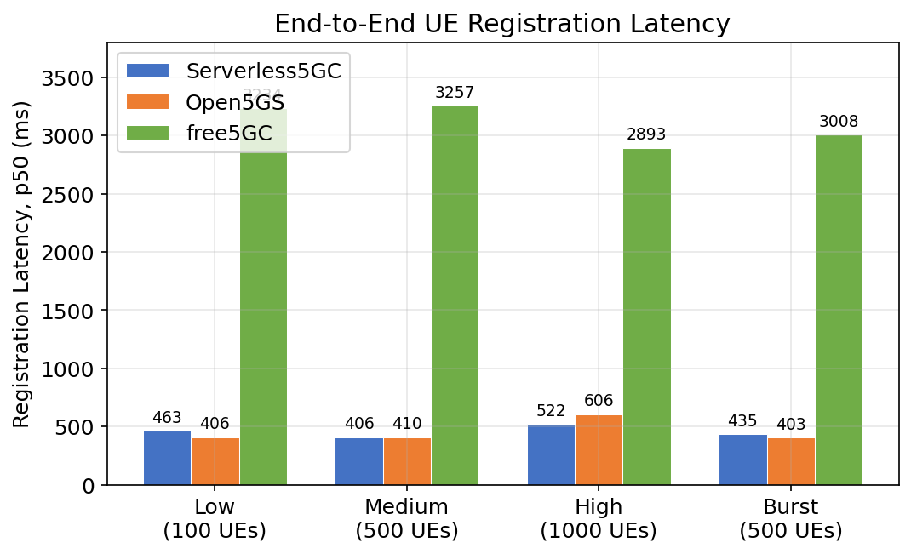
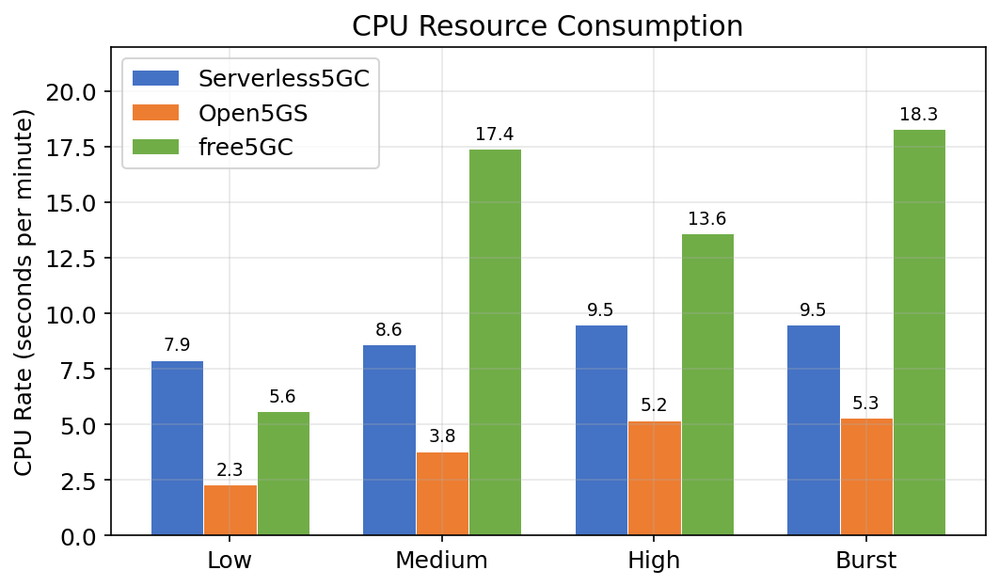
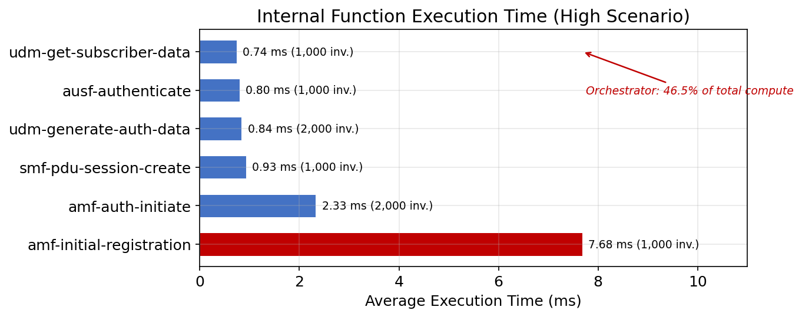
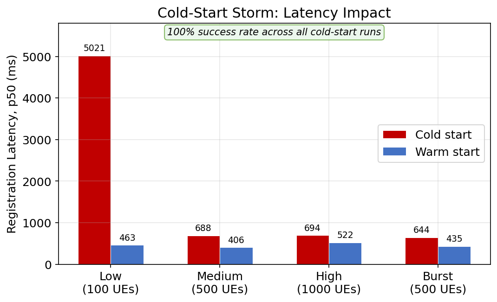

# Serverless5GC

A serverless 5G core network implementation using Procedure-as-a-Function decomposition on OpenFaaS. Serverless5GC maps 31 individual 3GPP procedures across 12 network functions (Release 15--17) to independent serverless functions that scale to zero when idle.

## Research Question

> Can a serverless (Function-as-a-Service) deployment model for the 5G core network maintain equivalent control plane performance to always-on deployments, and under what conditions does it offer a cost advantage?

## Architecture

Serverless5GC follows a **Procedure-as-a-Function** model: each 3GPP procedure (e.g., UE Registration, PDU Session Establishment) maps to one OpenFaaS function. NF identity is logical -- the "AMF" is a collection of functions sharing state in Redis.



### Key Design Decisions

- **Stateless functions** -- all UE context, PDU session state, and security parameters are externalized to Redis. Functions are pure request handlers with no in-memory state between invocations.
- **SCTP-HTTP proxy** -- a custom Go binary terminates SCTP from the gNB (TS 38.412), decodes the NGAP header to determine the procedure, and forwards the payload as an HTTP POST to the corresponding OpenFaaS function.
- **NRF in etcd** -- NF service discovery is stored in etcd with prefix-based queries; NRF functions are thin wrappers over etcd CRUD operations.

## 5G Network Functions

12 NFs decomposed into 31 OpenFaaS functions:

| NF | Functions | 3GPP Reference |
|----|-----------|----------------|
| **AMF** | `amf-initial-registration`, `amf-deregistration`, `amf-service-request`, `amf-pdu-session-relay`, `amf-handover`, `amf-auth-initiate` | TS 23.502 |
| **SMF** | `smf-pdu-session-create`, `smf-pdu-session-update`, `smf-pdu-session-release`, `smf-n4-session-setup` | TS 23.502 |
| **UDM** | `udm-generate-auth-data`, `udm-get-subscriber-data` | TS 29.503 |
| **UDR** | `udr-data-read`, `udr-data-write` | TS 29.504 |
| **AUSF** | `ausf-authenticate` | TS 29.509 |
| **NRF** | `nrf-register`, `nrf-discover`, `nrf-status-notify` | TS 29.510 |
| **PCF** | `pcf-policy-create`, `pcf-policy-get` | TS 29.512 |
| **NSSF** | `nssf-slice-select` | TS 29.531 |
| **NWDAF** | `nwdaf-analytics-subscribe`, `nwdaf-data-collect` | TS 29.520 |
| **CHF** | `chf-charging-create`, `chf-charging-update`, `chf-charging-release` | TS 32.291 |
| **NSACF** | `nsacf-slice-availability-check`, `nsacf-update-counters` | TS 29.536 |
| **BSF** | `bsf-binding-register`, `bsf-binding-discover`, `bsf-binding-deregister` | TS 29.521 |

## Tech Stack

| Component | Technology |
|-----------|-----------|
| Language | Go 1.25.5 |
| FaaS Platform | [OpenFaaS](https://www.openfaas.com/) on [K3s](https://k3s.io/) |
| Session State | [Redis 7](https://redis.io/) |
| NRF Registry | [etcd 3.5](https://etcd.io/) |
| RAN Simulator | [UERANSIM](https://github.com/aligungr/UERANSIM) |
| Infrastructure | Self-hosted VMs (4 vCPU / 8 GB, Frankfurt) |

## Evaluation Results

Evaluated against Open5GS (C-based) and free5GC (Go-based) across 5 traffic scenarios (idle, low, medium, high, burst) on isolated VMs (4 vCPU, 8 GB RAM). All results are 3-run averages measured end-to-end from UERANSIM logs.

### Registration Latency



| Scenario | Serverless5GC p50 | Open5GS p50 | free5GC p50 |
|----------|------------------:|------------:|------------:|
| Low (100 UEs) | 463 ms | 406 ms | 3,234 ms |
| Medium (500 UEs) | 406 ms | 410 ms | 3,257 ms |
| High (1000 UEs) | 522 ms | 606 ms | 3,592 ms |
| Burst (500 UEs, 50 reg/s) | 435 ms | 403 ms | 3,008 ms |

Serverless5GC achieves **latency parity with C-based Open5GS** (406--522 ms vs 403--606 ms) and is **5--8x faster than Go-based free5GC**. Internal function execution (15.56 ms for 8 invocations) accounts for 3.4% of end-to-end latency; the rest is protocol-inherent NAS round trips.

### Resource Consumption



| | Serverless5GC | Open5GS | free5GC |
|---|---|---|---|
| CPU growth (idle to high) | +25% | +160% | +429% |
| Memory range | 2,105--2,138 MB (+1.6%) | 1,368--1,605 MB (+17%) | 1,378--1,584 MB (+15%) |

The serverless architecture has a higher baseline (~7.6 s/min idle) due to the K3s/OpenFaaS platform, but CPU scales minimally with traffic. Memory is virtually flat regardless of load, confirming stateless function execution with no per-UE overhead.

### Function Execution Breakdown



Each UE registration triggers a deterministic chain of exactly **8 function invocations** with a total compute time of 15.56 ms. The `amf-initial-registration` orchestrator dominates (49.4% of compute) while downstream functions complete in under 1 ms.

| Metric | Value |
|--------|-------|
| Function invocations per registration | 8 |
| Total internal compute time | 15.56 ms |
| Memory per invocation | 128 MB |
| **Resource-time per registration** | **0.002 GB-s** |

This platform-independent metric maps directly to FaaS billing granularity. A cost model analysis shows serverless is cheaper than always-on when the cluster operates below 65% duty cycle, when 2+ tenants share the platform, or on managed FaaS platforms up to 609 reg/s.

### Cold-Start Storm Resilience



Worst-case test: all 31 function pods deleted, UE registrations started simultaneously.

| Scenario | Cold p50 | Warm p50 | Penalty |
|----------|:--------:|:--------:|:-----:|
| Low (100 UEs) | 5,037 ms | 463 ms | 11x |
| Medium (500 UEs) | 366 ms | 406 ms | -40 ms |
| High (1000 UEs) | 377 ms | 522 ms | -145 ms |
| Burst (500 UEs) | 361 ms | 435 ms | -74 ms |

**100% success rate** across all cold-start runs. Zero NAS T3510 timer expirations. The system converges to warm-start performance within 4--5 seconds. In multi-batch scenarios (500--1000 UEs), 80--90% of UEs arrive after pods initialize, pulling the median below the warm baseline; cold-start impact is visible only at p95/p99.

### Key Findings

| # | Finding | Detail |
|---|---------|--------|
| 1 | **Latency parity** | 406--522 ms median matches Open5GS (403--606 ms), 5--8x faster than free5GC |
| 2 | **100% reliability** | 6,300/6,300 registrations successful across all scenarios |
| 3 | **Load-independent scaling** | Per-function execution stable within +/-4.1% from 1 to 20 reg/s (20x range) |
| 4 | **Cold-start resilience** | 100% success under simultaneous pod deletion, convergence in 4--5 s |
| 5 | **Resource efficiency** | 0.002 GB-s per registration; memory flat at 2,105--2,138 MB regardless of traffic |
| 6 | **Conditional cost advantage** | Cheaper than always-on when duty cycle < 65%, 2+ tenants share platform, or on managed FaaS (up to 609 reg/s) |

## Getting Started

### Build

```bash
# Run unit tests
make test

# Build the SCTP proxy
make build-proxy

# Build all 31 function images
bash deploy/openfaas/build-functions.sh
```

### Deploy on K3s + OpenFaaS

```bash
# 1. Install K3s
curl -sfL https://get.k3s.io | INSTALL_K3S_EXEC="--disable traefik" sh -
export KUBECONFIG=/etc/rancher/k3s/k3s.yaml

# 2. Install OpenFaaS
helm repo add openfaas https://openfaas.github.io/faas-netes/
helm install openfaas openfaas/openfaas \
    --namespace openfaas --create-namespace \
    --set functionNamespace=openfaas-fn \
    --set generateBasicAuth=true --wait

# 3. Deploy infrastructure (Redis, etcd)
kubectl apply -f deploy/k3s/

# 4. Deploy functions
bash deploy/openfaas/build-functions.sh --push
faas-cli up -f deploy/openfaas/stack.yml

# 5. Start SCTP proxy
./cmd/sctp-proxy/sctp-proxy
```

### Run Evaluation

```bash
# Provision subscribers
bash eval/scripts/provision-subscribers.sh <serverless_ip> 1000

# Run a scenario
SERVERLESS_IP=<ip> LOADGEN_IP=<ip> bash eval/scripts/run-coldstart.sh <scenario> [run]

# Run full campaign (5 scenarios x 3 runs, adjust for your environment)
bash eval/scripts/run-campaign.sh
```

## Project Structure

```
serverless5gc/
├── cmd/sctp-proxy/          # SCTP-HTTP bridge binary
├── functions/               # 31 OpenFaaS function handlers
│   ├── amf/                 # 6 AMF procedures
│   ├── smf/                 # 4 SMF procedures
│   ├── udm/, udr/, ausf/   # Auth chain
│   ├── nrf/, pcf/, nssf/   # Supporting NFs
│   ├── nwdaf/, chf/        # R17: Analytics, Charging
│   ├── nsacf/, bsf/        # R17: Admission, Binding
├── pkg/                     # Shared libraries
│   ├── crypto/              # Milenage 5G-AKA (TS 35.208)
│   ├── models/              # 3GPP data types
│   ├── nas/                 # NAS codec (TS 24.501)
│   ├── ngap/                # NGAP decoder (TS 38.413)
│   ├── state/               # KVStore (Redis/etcd)
├── deploy/
│   ├── openfaas/            # Function definitions + Dockerfile
│   ├── k3s/                 # Infrastructure manifests
│   └── baselines/           # Open5GS + free5GC configs
├── eval/
│   ├── scenarios/           # Traffic scenario definitions
│   ├── scripts/             # Evaluation automation
│   └── results/             # Raw experiment data
└── test/integration/        # Integration tests
```

## References

- 3GPP TS 23.501/502 (5G System Architecture & Procedures)
- 3GPP TS 24.501 (NAS Protocol), TS 38.413 (NGAP)
- 3GPP TS 33.501 (Security), TS 35.208 (Milenage)
- [Open5GS](https://open5gs.org/), [free5GC](https://free5gc.org/), [UERANSIM](https://github.com/aligungr/UERANSIM)
- [OpenFaaS](https://www.openfaas.com/), [K3s](https://k3s.io/)

## License

This project is developed for academic research purposes.
